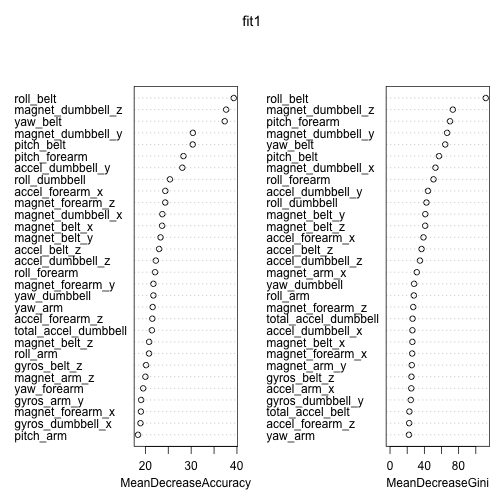

Predict Exercise Excellence
===========================

## Executive Summary

We aim to predict how well people perform barbell lifts utilizing data collected from activity monitoring devices. The data is collected from 6 particpants. Each of the 6 people were asked to perform the barbell lifts correctly and in 5 different incorrect way.

## Data Analysis

The input data consisted of various movement measurments including acceleration components of the arms and pitch and roll orientations of the dumbell. The data comes from the original source: http://groupware.les.inf.puc-rio.br/har.

### Data load and transformations

Read both training and test data from the downloaded files. After exploring the data, it is discovered that values for some varibales are 'NA' or empty strings. We remove these variables and unrelated variables from the data.


```r
library(caret)
library(knitr)
library(randomForest)

# Read the training and testing data data
training <- read.csv("pml-training.csv", na.strings = c("", "NA", "#DIV/0!"), stringsAsFactors=FALSE)
testing <- read.csv("pml-testing.csv", na.strings = c("", "NA", "#DIV/0!"), stringsAsFactors=FALSE)

# Remove the first seven columns, as they don't capture the required data
training <- training[ , -(1:7)]

na_test = sapply(training, function(x) {sum(is.na(x))})
table(na_test)
```

```
## na_test
##     0 19216 19217 19218 19220 19221 19225 19226 19227 19248 19293 19294 
##    53    67     1     1     1     4     1     4     2     2     1     1 
## 19296 19299 19300 19301 19622 
##     2     1     4     2     6
```

```r
# function for determining sparseness of variables
sparseness <- function(a) {
    n <- length(a)
    na.count <- sum(is.na(a))
    return((n - na.count)/n)
}

# sparness of input variables based on training subset
variable.sparseness <- apply(training, 2, sparseness)

# trim down the training by removing sparse variables
training <- training[, variable.sparseness > 0.9]
```

## Model Building

### Model Selection

After the data transformation on training dataset, 52 variables(excluding classe) are left. We choose random forest for our model building as random forests tend to work better with higher number of predictors and trim down the inputs. Also random forests has a built in cross-validation component that gives an unbiased estimate of the forest's out-of-sample (OOB) error rate.

### Variable selection

```r
set.seed(1331)
inVarImp <- createDataPartition(y = training$classe, p = 0.1, list = F)
varImpTest <- training[inVarImp, ]
varImpTrain <- training[-inVarImp, ]
fit1 <- randomForest(as.factor(classe) ~ ., data = varImpTest, method = "rf", importance=TRUE)

varImpPlot(fit1)
```

 

## Out-Of-Sample Error

Select the top 25 important variables for the final model fit and build the model on the 75% of the training subset. Now predict the classe outcome on the remaining 25% training subset.


```r
set.seed(12345)
thresh <- quantile(fit1$importance[ , 1], 0.75)
impfilter <- fit1$importance[, 1] >= thresh
training <- training[, impfilter]
index <- createDataPartition(y = training$classe, p = 0.75, list = F)
finalTrain <- training[index, ]
finalTest <- training[-index, ]
bestFit <- randomForest(as.factor(classe) ~ ., data = finalTrain, method = "rf", importance=TRUE)
predict <- predict(bestFit, finalTest)
mean(predict(bestFit, finalTest) == finalTest$classe) * 100
```

```
## [1] 99.20473
```

The model is 99.2651% accurate.

## Model Application

The trained random forest will now use the testing sub data set to examine the out of sample error rate. We perform feature selection from testing subset such that it is an unbiased estimate of the random forest's prediction accuracy.


```r
testing <- testing[ , -(1:7)]
testing <- testing[, variable.sparseness > 0.9]
testing <- testing[, impfilter]
final_col <- length(colnames(testing[]))
colnames(testing)[final_col] <- 'classe'
prediction <- predict(bestFit , testing)
prediction
```

```
##  1  2  3  4  5  6  7  8  9 10 11 12 13 14 15 16 17 18 19 20 
##  B  A  B  A  A  E  D  B  A  A  B  C  B  A  E  E  A  B  B  B 
## Levels: A B C D E
```
